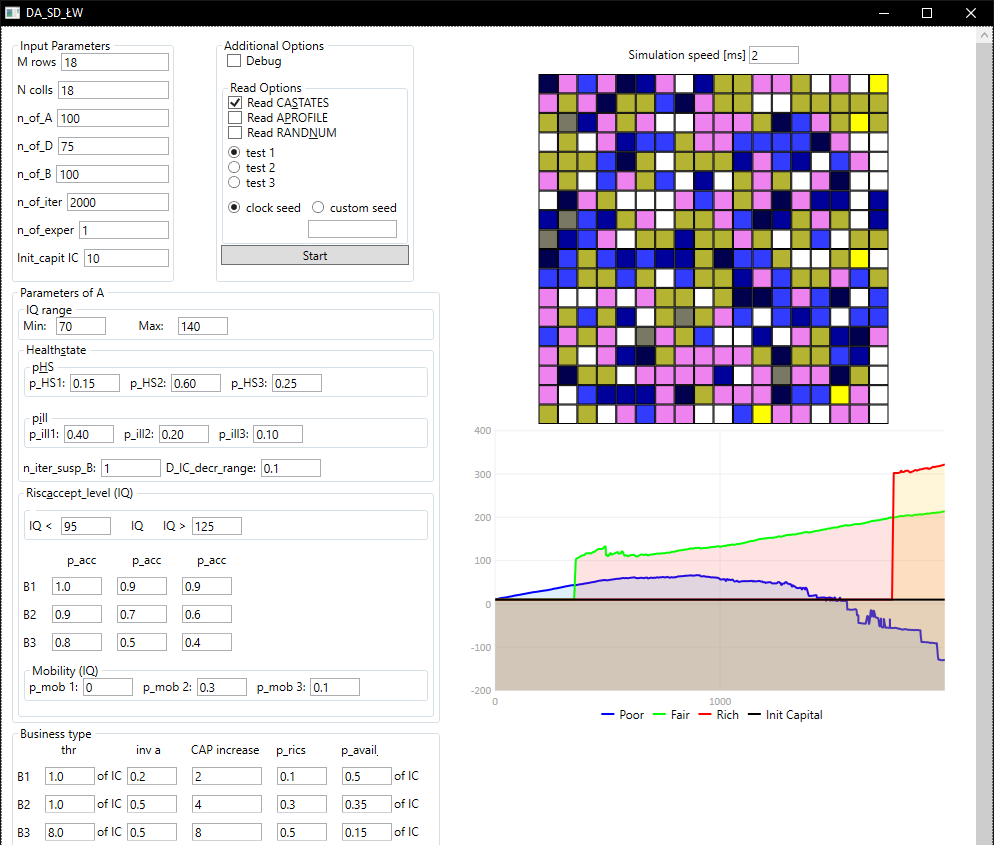

A simulator of change in the financial status of people as a result as happy and unhappy events using a cellular automata. 
Written in C# 12 and WPF.

&copy; Damian Adamiak  Sebastian Dreszer 
Łukasz Wysocki 
March - June 2024

Main view of application with running simulation
